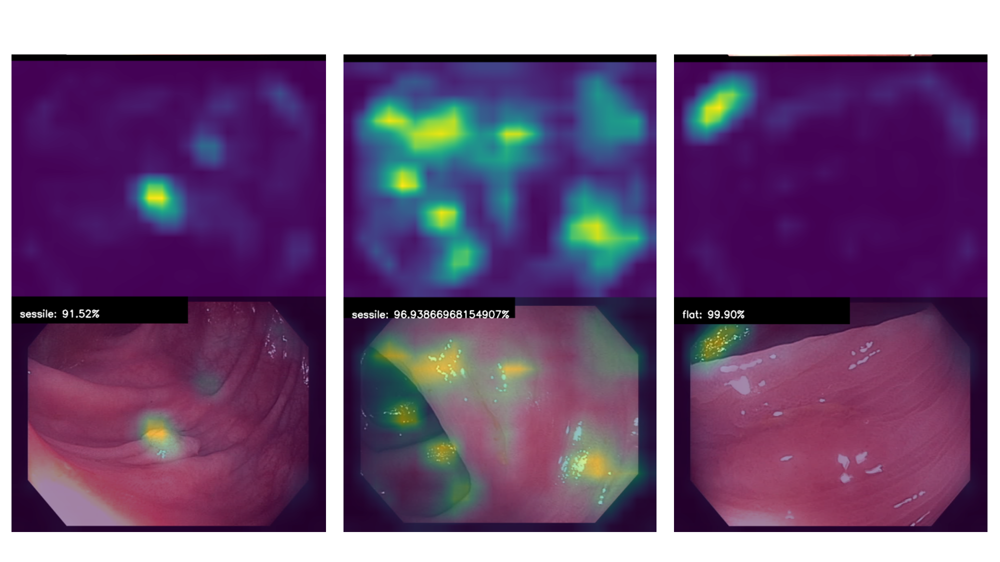

# Construction of a novel Database  and evaluation of Artificial Neural Networks for Endoscopic Classification of Superficial Neoplastic Lesions

Author: Stefano Magni 
Advisor: Prof. Anna Maria Bianchi 
Co-advisor: Prof. Cristiano Spada 

## Abstract 

The increase in the complexity of the techniques required to detect and perform diagnosis “in vivo” with high quality standards and the subsequent need of highly skilled endoscopists has boosted the interest in the implementation of Artificial Intelligence algorithms to support the practitioner during Colorectal Cancer Screening colonoscopies. Even though Deep Learning Convolutional Neural Networks applied to the detection and classification of superficial neoplastic lesions have shown promising results, they still have several limitations mainly related to the lack of large enough real world datasets. In fact, most of currently available data is confined to research purposes and do not reflect the variety of conditions that the clinicians face in the daily practice. Therefore, this thesis aims at building a novel real-world polyp  multi-label classification database and to validate a scalable data collection pipeline that can be implemented in the Endoscopic Operative Units. The second objective is to use the just created dataset to investigate the feasibility of extending current off-the-shelf state-of-the-art ResNet-50 and Capsule Network models to the Paris and Nice classification taxonomies adopted by endoscopists to assess the depth of invasion and severity of the lesions. A preliminary dataset of 525 polyp sequences representing 191 unique polyps was collected from 100 colonoscopies for a total of 26'000 frames, in Fondazione Poliambulanza Hospital Brescia (IT). This private dataset is to be considered one of the biggest for polyp classification tasks and spans across more than one year of clinical practice. Among the trained models the best performances have been obtained by the ResNet-50 which obtained 56% ± 12 % accuracy, 57% ± 12% precision and 56% ± 10% recall during 5 fold cross validation.

## Output 
The output of the code is an image for each predicted frame, its output probability and the Gradcam activation map superimposed to it.

## TO DO 
- [] Implement tf.data pipeline for faster training 
- [] Predict using sequence of images (average probabilities or logit)
- [] Design custom network 
- [] Extend database size 